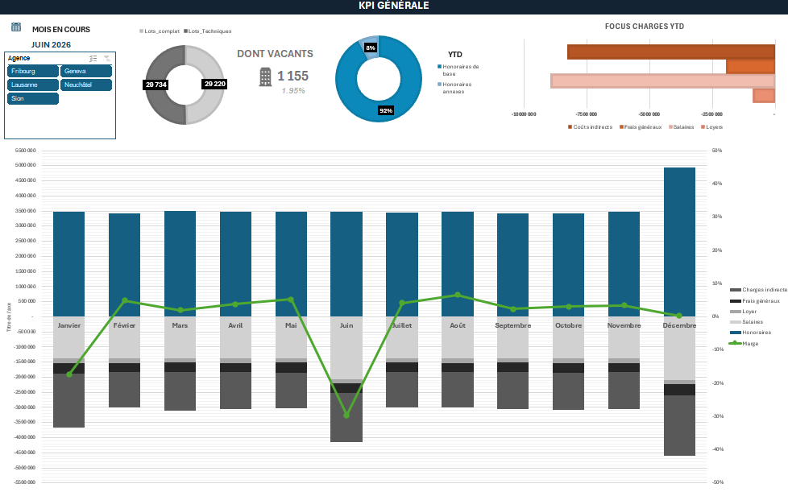
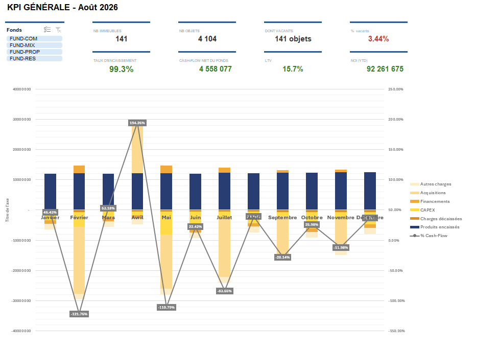

<!DOCTYPE html>
<html lang="fr">
<head>
<meta charset="UTF-8">
<meta name="viewport" content="width=device-width, initial-scale=1.0">
<title>Soraya Ahmed — Contrôleuse de gestion senior | Business Partner Finance</title>
<meta name="description" content="Portfolio — tableaux de bord Excel pour le contrôle de gestion et le reporting immobilier en Suisse.">
<link rel="preconnect" href="https://fonts.googleapis.com">
<link rel="preconnect" href="https://fonts.gstatic.com" crossorigin>
<link href="https://fonts.googleapis.com/css2?family=Fraunces:opsz,wght@9..144,400;9..144,500;9..144,600&family=IBM+Plex+Sans:wght@400;500;600&family=IBM+Plex+Mono:wght@400;500&display=swap" rel="stylesheet">
<link rel="stylesheet" href="assets/style.css">
</head>
<body>

Portfolio — Contrôle de gestion

<header class="masthead">
  

    
Portfolio de reporting &amp; data — Suisse

    <h1>Soraya&nbsp;Ahmed</h1>
    
Contrôleuse de gestion senior | Business Partner Finance

    <dl class="meta-row">
      
<dt>Contact</dt><dd><a href="mailto:Soraya.bah67@icloud.com">Soraya.bah67@icloud.com</a></dd>

      
<dt>Profil</dt><dd><a href="https://www.linkedin.com/in/soraya-ahmed/" target="_blank" rel="noopener">LinkedIn</a></dd>

      
<dt>CV</dt><dd><a href="assets/CV_Soraya_Ahmed.pdf" download>Télécharger</a></dd>

    </dl>
  

</header>

<nav class="toc" aria-label="Sommaire">
  <ol>
    <li><a href="#profil">01Profil</a></li>
    <li><a href="#competences">02Compétences</a></li>
    <li><a href="#projets">03Projets</a></li>
    <li><a href="#contact">04Contact</a></li>
  </ol>
</nav>

<main>

  <section id="profil" class="section">
    
01

    <h2>Profil</h2>
    

      

        Contrôleuse de gestion expérimentée, spécialisée dans l'analyse financière,
        le reporting et le pilotage de la performance. Rigoureuse et dotée d'un fort
        esprit critique, je veille à la fiabilité des données, analyse les écarts et
        transforme les informations financières en indicateurs et recommandations
        utiles à la prise de décision.
      

    

  </section>

  <section id="competences" class="section">
    
02

    <h2>Compétences</h2>
    <ul class="tags">
      <li>Excel avancé</li>
      <li>Analyse financière</li>
      <li>Reporting &amp; automatisation</li>
      <li>Contrôle qualité des données</li>
      <li>Élaboration budgétaire et Forecast</li>
    </ul>
  </section>

  <section id="projets" class="section">
    
03

    <h2>Projets</h2>

    <article class="dossier">
      

        
Étude de cas — 01

        <h3>Tableau de bord régie immobilière</h3>
        
Suivi d'activité multi-agences — Suisse romande

      

      
      

        Pilotage de 5 agences fictives (Genève, Lausanne, Fribourg, Neuchâtel, Sion) :
        nombre d'objets en gestion, taux de vacance, effectifs, charges d'exploitation
        et refacturation des charges indirectes du siège vers chaque agence.
      

      
5 agences · ~58 000 lots gérés · ~43 M de CA · 12 mois de données — données fictives

      

        
Structure du projet

        <dl>
          
<dt>Synthèse</dt><dd>Vision globale de l'activité, de la rentabilité, du portefeuille et des principaux indicateurs de performance.</dd>

          
<dt>Performances financières</dt><dd>Analyse du chiffre d'affaires, du budget, des charges, de l'EBITDA et de la formation du résultat.</dd>

        </dl>
      

      

        Le projet présenté a volontairement été simplifié afin d'en faciliter la
        compréhension et de mettre en évidence les principaux axes d'analyse. Dans
        un contexte opérationnel, les possibilités d'analyse sont naturellement
        plus larges et peuvent être adaptées aux besoins de pilotage et aux
        problématiques identifiées. Les données peuvent notamment être analysées
        selon différents niveaux de granularité : par portefeuille, par client,
        par immeuble, par objet, par typologie ou encore par période. Ces
        différents axes permettent de croiser les informations, d'identifier plus
        finement les écarts et les tendances, de comparer les performances et de
        faire ressortir les principaux leviers d'amélioration.
      

      

        <a class="btn" href="projets/Dashboard_Agences.xlsx" download>Télécharger le fichier .xlsx</a>
      

    </article>

    <article class="dossier">
      

        
Étude de cas — 02

        <h3>Tableau de bord fonds immobilier</h3>
        
Vue investisseur — NAV, LTV &amp; performance locative

      

      
      

        Suivi de 4 fonds immobiliers fictifs (résidentiel, commercial, mixte,
        propriété) : NAV mensuelle, LTV, taux d'occupation et d'encaissement,
        cash-flow, budget vs réalisé et suivi des contentieux locataires.
      

      
4 fonds · Gestion mixte · Suivi mensuel des KPI de performance — données fictives

      

        
Structure du projet

        <dl>
          
<dt>Synthèse</dt><dd>Vue consolidée du portefeuille : valeur des actifs, NAV, LTV, NOI, cash-flow net, occupation, encaissement, CAPEX et comparaison du positionnement rendement/endettement des fonds.</dd>

          
<dt>Fonds</dt><dd>Analyse de chaque fonds individuellement grâce au filtre dédié : valeur du portefeuille, NAV et NAV par part, dette, LTV, évolution du cash-flow.</dd>

          
<dt>Débiteurs</dt><dd>Suivi de la facturation et des encaissements, de la balance âgée, des retards, des provisions, des pertes, du DSO et des dossiers de recouvrement prioritaires.</dd>

          
<dt>Finance</dt><dd>Compte de résultat de la société de gestion, analyse des revenus par fonds.</dd>

          
<dt>Glossaire</dt><dd>Référentiel des principaux indicateurs du rapport, avec leur définition financière ou immobilière et leur méthode de calcul.</dd>

        </dl>
      

      

        Le projet présenté a volontairement été simplifié afin d'en faciliter la
        lecture et de mettre en évidence les principaux axes de pilotage de la
        performance d'un fonds d'investissement. Dans un contexte opérationnel,
        les analyses peuvent être approfondies et adaptées aux besoins de la
        gestion, du reporting et du suivi de la performance. Les données peuvent
        notamment être analysées à différents niveaux : par fonds, par
        portefeuille, par classe d'actifs, par investissement, par secteur, par
        zone géographique, par stratégie ou encore par période. Le croisement de
        ces différents axes permet d'affiner l'analyse de la performance,
        d'identifier les écarts et les tendances, de comparer les différents
        investissements et de mettre en évidence les principaux contributeurs ou
        facteurs de sous-performance du fonds.
      

      

        <a class="btn" href="projets/Dashboard_Fonds.xlsx" download>Télécharger le fichier .xlsx</a>
      

    </article>

  </section>

  <section id="contact" class="section">
    
04

    <h2>Contact</h2>
    

      
Pour toute question sur ces modèles ou une opportunité — n'hésitez pas à me contacter.

      

        <a class="btn" href="mailto:Soraya.bah67@icloud.com">Écrire un e-mail</a>
      

    

  </section>

</main>

<footer class="colophon">
  
Soraya Ahmed — Contrôleuse de gestion senior | Business Partner Finance. Projets à but de démonstration, données fictives.

</footer>

</body>
</html>
